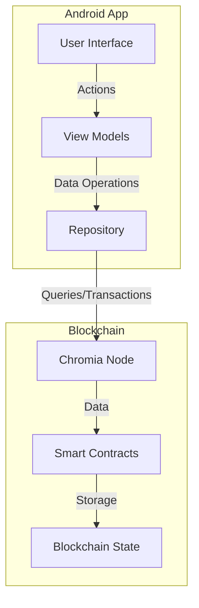
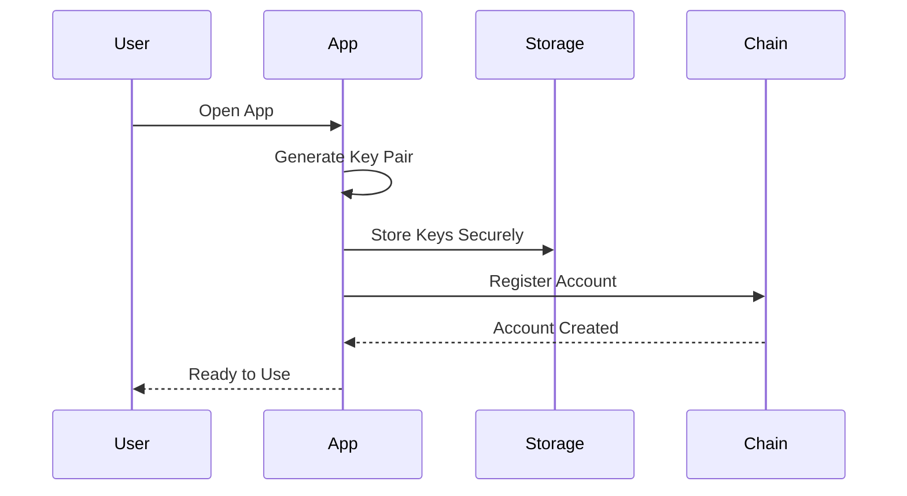
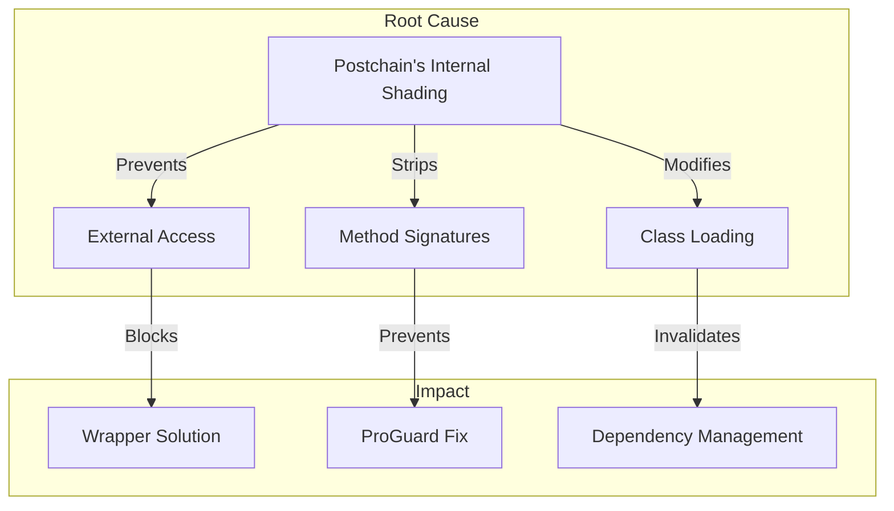

# Todo App - Chromia Blockchain Integration


## Table of Contents
- [Author Information](#author-information)
- [Project Description](#project-description)
- [How It Works](#how-it-works)
- [Current Status](#current-status)
- [Setup Instructions](#setup-instructions)
  - [Prerequisites](#prerequisites)
  - [Blockchain Setup](#blockchain-setup)
  - [Android Studio Setup](#android-studio-setup)
- [Installation Guide](#installation-guide)
- [Usage Instructions](#usage-instructions)
- [Known Issues](#known-issues)
- [Resolved Issues](#resolved-issues)
- [Additional Information](#additional-information)

## Author Information
- **Name**: [Your Name]
- **Email**: [Your Email]
- **GitHub**: [Your GitHub Profile]

## Project Description
A multi-user todo-list application built with Chromia blockchain integration, allowing users to manage their tasks securely and efficiently. The app demonstrates the implementation of blockchain-based user authentication and data management in an Android environment.

### Key Features
- Secure key pair authentication
- Task creation and management
- Real-time blockchain synchronization
- Modern Material Design UI
- Dark mode support
- Offline capability with error handling

## How It Works

### Architecture Overview


### Authentication Flow


## Current Status

> ⚠️ **Important Note**: While the app's core functionality is implemented, we are currently facing some limitations due to issues with the Postchain client library. These issues are outside of our control and require updates from the Chromia team.

### Working Features
- ✓ Account creation and key pair generation
- ✓ Modern, responsive UI with dark mode support
- ✓ Local task management
- ✓ Error handling and user feedback

### Limited Features
Due to Postchain client library issues:
- ⚠️ Blockchain synchronization (read operations affected)
- ⚠️ Real-time updates
- ⚠️ Multi-device synchronization

## Setup Instructions

### Prerequisites
1. **Docker**
   - Install [Docker Desktop](https://www.docker.com/products/docker-desktop)
   - Ensure Docker daemon is running

2. **Node.js**
   - Install [Node.js](https://nodejs.org/) (v14 or higher)
   - Verify installation:
     ```bash
     node --version
     npm --version
     ```

3. **Android Studio**
   - Download from [developer.android.com/studio](https://developer.android.com/studio)
   - Minimum system requirements:
     - 8GB RAM (16GB recommended)
     - 10GB free storage
     - Intel Core i5/AMD Ryzen 5 or better

### Blockchain Setup

1. Install Chromia CLI:
```bash
npm install -g chr-cli
```

2. Stop local PostgreSQL service:
   - Windows:
     
   - Linux: `sudo service postgresql stop`
   - macOS: `brew services stop postgresql`

3. Start Docker and PostgreSQL container:
```bash
docker-compose up -d
```

4. Configure Chromia:
```bash
chr install
chr node start
```

5. Configure `chromia_config.properties`:


```properties
blockchain.rid=YOUR_BRID_HERE
node.url=http://10.0.2.2:7740
```

### Android Studio Setup

1. Clone and open project:
```bash
git clone <repository-url>
cd todo-app
```

2. Open in Android Studio:
   - File > Open > Select android folder
   - Wait for Gradle sync

3. Create virtual device:
   - Tools > Device Manager
   - Create Device > Select Pixel 2
   - Download system image

4. Build and run:
   

## Installation Guide

### Direct Installation
1. Download the latest APK from [Releases](https://github.com/yourusername/todo-app/releases)
2. Enable "Install from Unknown Sources" for your browser
3. Open the downloaded APK to install

### QR Code Installation
Scan this QR code to download the latest version:


> Note: Your device may warn about installing apps from unknown sources. This is normal for apps not from the Play Store.

## Usage Instructions

### Account Management
1. Launch the app
2. Generate a new key pair
3. Your account is created automatically

### Task Management
- Add tasks with title and description
- Mark tasks as complete
- Edit or delete existing tasks
- Filter tasks by status

### Known Limitations
When encountering blockchain connectivity issues, you'll see this message:


This is a known limitation of the current Postchain client version.

## Known Issues

### Postchain Client Limitations
The app currently faces limitations due to the Postchain client library's implementation:



## Resolved Issues

### Documentation and Implementation
- ✓ Fixed Postchain client dependency resolution
- ✓ Resolved META-INF conflicts
- ✓ Fixed BouncyCastle version conflicts
- ✓ Improved error handling and user feedback

## Additional Information

### Development Notes
- The app uses Material Design 3 components
- Implements MVVM architecture
- Uses Kotlin Coroutines for async operations
- Includes comprehensive error handling

### Future Improvements
1. Implement caching for offline support
2. Add task categories and priorities
3. Implement task sharing between users
4. Add push notifications

### Contributing
We welcome contributions! Please read our [Contributing Guidelines](CONTRIBUTING.md) before submitting pull requests.

### License
This project is licensed under the MIT License - see the [LICENSE](LICENSE) file for details. 