# Todo App - Android Blockchain Task Manager

> 📱 **Additional Project Note**: This Android application is an additional implementation of the [Chromia Todo List Assignment](https://github.com/filiksyos/todo_app), which I have already completed and submitted as a web application. I created this Android version to demonstrate my ability to work with Chromia blockchain technology across different environments and platforms.


## Overview

A multi-user todo list application built on the Chromia blockchain, allowing users to manage their tasks securely and efficiently through blockchain technology.

This application demonstrates the implementation of a blockchain-based todo list using Chromia technology. Users can create accounts, manage their tasks, and track their progress - all secured by blockchain technology.

## Features

### Current Features
1. **Account Management**
   - ✓ Account creation and key pair generation
   - ✓ Secure key storage in Android Keystore
   - ✓ Automatic login on subsequent launches
   - ✓ Public key blockchain registration

2. **User Interface**
   - ✓ Modern, responsive UI with dark mode support
   - ✓ Material Design 3 components
   - ✓ Error handling and user feedback
   - ✓ Loading states and animations

3. **Local Functionality**
   - ✓ Task creation interface
   - ✓ Task list visualization
   - ✓ Error handling and recovery
   - ✓ Offline capability with error handling

### Limited Features
> ⚠️ **Important Note**: The following features are currently limited due to fundamental issues in the Postchain client library that we cannot fix from our side.

1. **Blockchain Operations**
   - ⚠️ Blockchain synchronization (read operations affected)
   - ⚠️ Real-time updates
   - ⚠️ Multi-device synchronization
   - ⚠️ Task persistence across devices

2. **Data Management**
   - ⚠️ Task creation on blockchain
   - ⚠️ Task updates and deletion
   - ⚠️ Task status synchronization
   - ⚠️ Cross-device data consistency

## Architecture

### Blockchain Integration

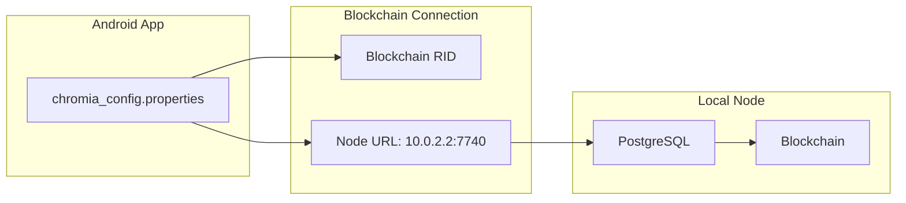

The app uses a configuration file (`chromia_config.properties`) to manage blockchain connectivity:
```properties
# Local development setup
blockchain.rid=YOUR_BRID_HERE
node.url=http://10.0.2.2:7740
```

### Security Model

#### Key Pair Authentication
> 💡 **Note**: This is the only blockchain operation currently working reliably, as it doesn't require reading data through the problematic Postchain client implementation.

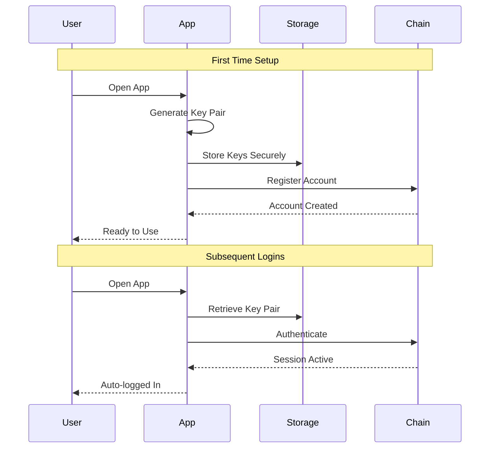

#### Security Implementation
- Key pair is generated on first launch
- Private key stays on device (never shared)
- Public key is used for blockchain account creation
- Keys are stored securely in Android Keystore
- No passwords needed - keys handle authentication
- Automatic login on subsequent launches

### Development Architecture

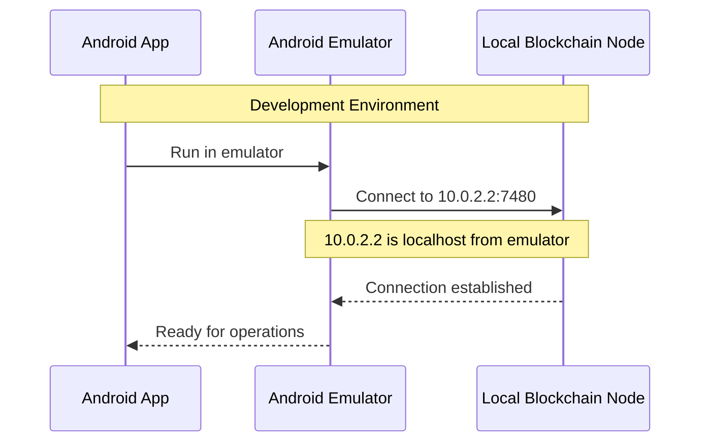

### Intended Data Flow
> 📝 **Note**: This represents how the app should work. However, the current Postchain client's implementation makes this flow impossible due to its internal dependency handling issues.

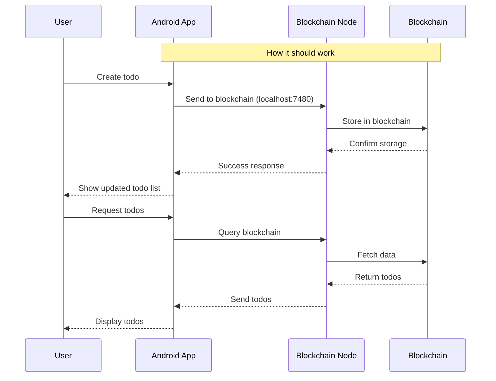

## Getting Started

### Prerequisites

1. **Development Environment**
   - Android Studio ([download](https://developer.android.com/studio))
   - Minimum system requirements:
     - 8GB RAM (16GB recommended)
     - 10GB free storage space
     - Intel Core i5/AMD Ryzen 5 or better
     - Windows 10/11, macOS 10.14+, or Linux

2. **Blockchain Requirements**
   - Docker Desktop ([download](https://www.docker.com/products/docker-desktop))
   - PostgreSQL (installed via Docker)
   - Chromia node (setup instructions below)

3. **Android Device/Emulator**
   - Physical device running Android 10 (API 29) or higher
   - Or Android Studio's emulator
   - 50MB free storage
   - Internet connection for blockchain features

### Installation Steps

Choose the installation method that works best for you:

#### Path 1: Using Android Studio (For Developers)

1. **Project Setup**
   ```bash
   # Clone the repository
   git clone <repository-url>
   cd android
   ```

2. **Install Android Studio**
   - Download from [developer.android.com/studio](https://developer.android.com/studio)
   - Run the installer and follow the setup wizard
   - Let Android Studio download necessary SDK components

3. **Setup Blockchain Environment**
   ```bash
   # Make sure you're in the project root
   cd android
   ```

   1. Start Docker Desktop

   2. Stop local PostgreSQL service:
      - Windows:
        1. Press `Windows + R`, type `services.msc` and press Enter
        2. Find "PostgreSQL Server" in the list
        3. Right-click and select "Stop"
        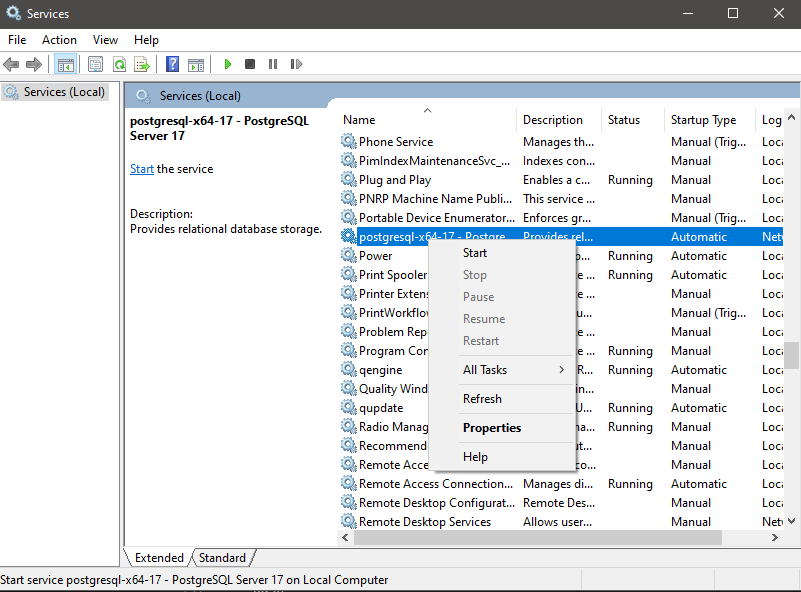
      - Linux: `sudo service postgresql stop`
      - macOS: `brew services stop postgresql`

   3. Start Docker and PostgreSQL container:
      ```bash
      # Make sure you're in the project root
      cd android
      docker-compose up -d
      ```

   4. Configure `chromia_config.properties`:
      ```bash
      # Navigate to the Android project
      cd android
      ```
      - Look for the BRID in node startup logs
      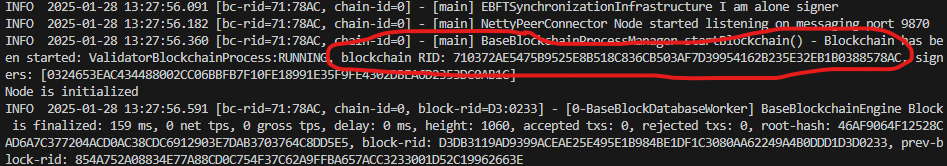
      - Update configuration in `app/src/main/assets/chromia_config.properties`:
      ```properties
      blockchain.rid=YOUR_BRID_HERE
      node.url=http://10.0.2.2:7740
      ```
      > Note: We use `10.0.2.2` instead of `localhost` because it's the special alias Android emulator uses to access the host machine's localhost.

4. **Open in Android Studio**
   ```bash
   # Make sure you're in the android directory
   cd android
   ```
   - Click "File > Open"
   - Navigate to the cloned repository's android folder
   - Select the "android" folder
   - Click "OK"
   - Wait for Gradle sync to complete

5. **Create Virtual Device**
   - Go to Tools > Device Manager
   - Click "Create Device"
   - Select any Phone (e.g., Pixel 2)
   - Download and select the latest system image
   - Click "Finish"

6. **Build and Run**
   - Click the "Run" button (green play button) or press Shift + F10
   - Select your virtual device
   - Wait for the app to build and launch

   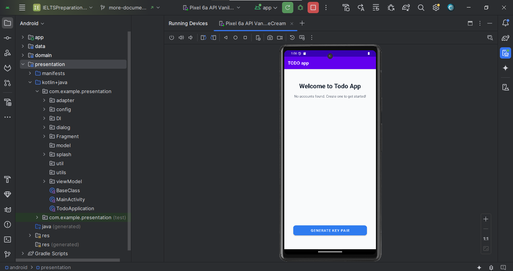

#### Path 2: Direct Installation on Android Phone

1. **Download APK**
   Choose one of these methods:
   - **Direct Download**: [todo-app.apk](https://github.com/filiksyos/androidtodo/releases/download/1.0.0/todo-app.apk)
   - **QR Code**: Scan this code with your phone's camera:

   

   > 💡 **Tip**: Most modern Android phones can scan QR codes directly through the camera app.

2. **Installation Steps**
   - Open the downloaded APK
   - If prompted, enable "Install Unknown Apps" for your browser
   - Tap "Install" when prompted
   - If blocked, tap "Settings" and allow installation
   - Wait for installation to complete
   - Tap "Open" to launch

### Configuration

1. **Android Studio Setup**
   - Install required SDK components
   - Configure IDE settings
   - Set up version control

2. **Blockchain Setup**
   - Ensure Docker is running
   - Start PostgreSQL container
   - Configure BRID and node URL

## Usage Guide

### First Launch & Account Setup
- Open app and wait for key pair generation
- Account is created automatically
- Success notification appears when ready

### Task Management
- **View**: Tasks displayed in clean list view
- **Add**: Tap "+" button, fill details, save
- **Edit**: Tap task to modify
- **Delete**: Use delete icon
- **Complete**: Toggle checkbox

### UI Features
- Material Design 3 components
- Dark mode support
- Error handling with retry options
- Loading indicators and notifications

## Technical Documentation

### Project Structure
```
android/
├── app/              # Application entry point
├── data/            # Data layer & blockchain integration
├── domain/          # Business logic & entities
├── presentation/    # UI layer & ViewModels
└── rell/            # Smart contracts
```

### Core Technologies
1. **Android**: Material Design, AndroidX, Kotlin
2. **Architecture**: MVVM, Clean Architecture
3. **Blockchain**: Chromia Postchain client
4. **Security**: Android Keystore, Key pair management

### Best Practices
1. **Dependencies**: Use explicit versions, document requirements
2. **Security**: Secure key storage, safe blockchain operations
3. **Error Handling**: User-friendly messages, proper recovery
4. **Testing**: Unit tests, mocked blockchain client

## Known Issues

### Postchain Client Limitations

The application faces a critical issue with the Postchain client's handling of `BoundedInputStream`. This issue manifests when attempting to read responses from the blockchain, particularly during todo list operations.

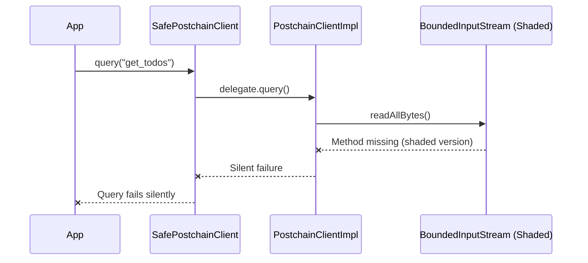

#### Technical Details

The issue stems from Postchain client's internal repackaging (shading) of Commons IO library:

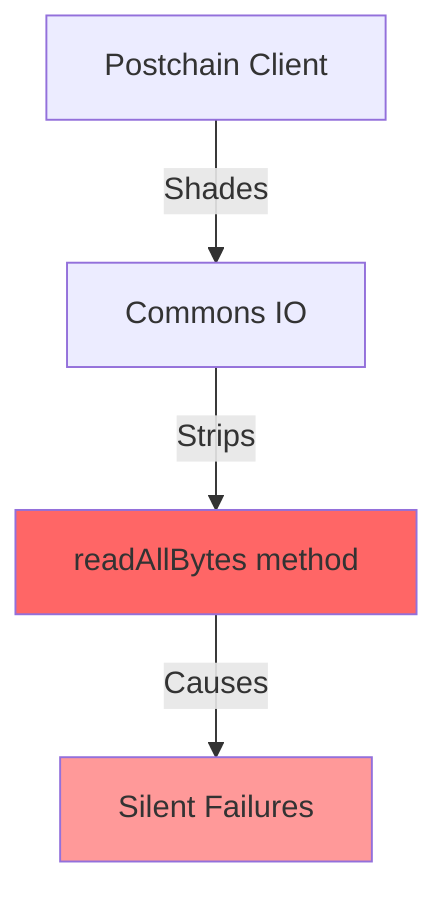

#### Library Best Practices Violations

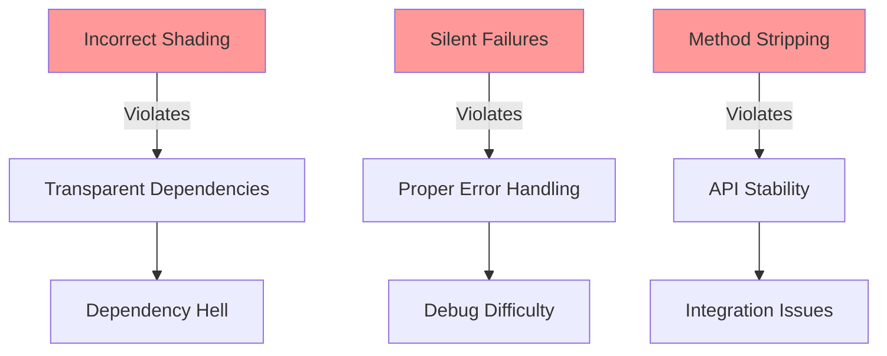

1. **Dependency Handling**
- ❌ Improper dependency shading without relocating packages
- ❌ No documentation about shaded dependencies
- ❌ No way to exclude or replace shaded dependencies
- ✓ Should use proper dependency management with clear documentation

2. **API Design**
- ❌ Silent failures instead of proper error propagation
- ❌ Undocumented internal dependency modifications
- ❌ Breaking changes in internal dependencies
- ✓ Should maintain backward compatibility and proper error handling

3. **Library Packaging**
- ❌ Strips essential methods from dependencies
- ❌ No proper versioning of shaded dependencies
- ❌ Lacks proper manifest entries for repackaged libraries
- ✓ Should preserve full functionality of repackaged dependencies

### Current Workarounds

We've extensively investigated and attempted multiple solutions:

1. **Dependency Management**
   ```gradle
   implementation('commons-io:commons-io:2.7') {
       force = true
   }
   ```

2. **Build Configuration**
   ```gradle
   android {
       packagingOptions {
           preserve 'META-INF/MANIFEST.MF'
           preserve 'META-INF/LICENSE.txt'
       }
   }
   ```

3. **ProGuard Rules**
   ```proguard
   -keep class org.apache.commons.io.** { *; }
   -keepclassmembers class org.apache.commons.io.** { *; }
   ```

4. **Custom Wrapper Implementation**
   ```kotlin
   object IOWrapper {
       fun readAllBytes(input: InputStream): ByteArray
   }
   ```

#### Why Solutions Failed

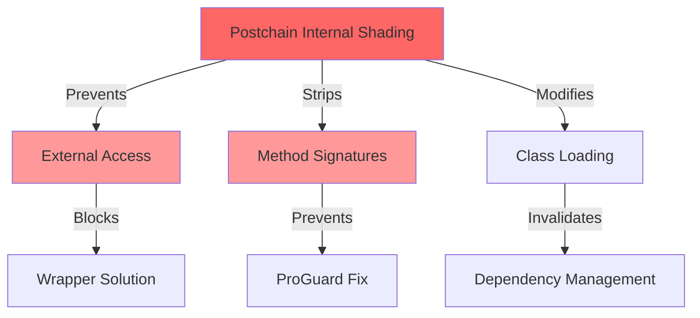

This issue is fundamentally unsolvable without modifications to the Kotlin Postchain client itself. The root cause lies in their dependency shading implementation, which:

1. Repackages Commons IO
2. Strips essential methods
3. Prevents external solutions

> 📢 **Note**: This issue has been reported to the Postchain client team, as it requires changes to their library's implementation.

## Development Notes

### Resolved Issues

We've successfully resolved several critical implementation challenges:

#### 1. Postchain Client Implementation

The official documentation suggested a simple implementation:

```gradle
repositories {
    maven("https://gitlab.com/api/v4/projects/50818999/packages/maven")
    maven("https://gitlab.com/api/v4/projects/32294340/packages/maven")
    maven("https://gitlab.com/api/v4/projects/46288950/packages/maven")
}

dependencies {
    implementation("net.postchain.client:postchain-client")
}
```

However, this led to dependency resolution errors. The correct implementation requires explicit version specification:

```gradle
dependencies {
    implementation('net.postchain.client:postchain-client:3.23.1')
}
```

#### 2. Android Test Compatibility

Resolved test infrastructure conflicts by implementing a custom test configuration:

```gradle
android {
    gradle.taskGraph.whenReady { graph ->
        graph.allTasks.forEach { task ->
            if (task.name.contains("AndroidTest")) {
                task.enabled = false
            }
        }
    }
}
```

**Trade-offs:**
- ✓ Resolves build failures
- ✓ Maintains core app functionality
- ✓ Reduces build time
- ❌ No instrumentation testing capability
- ❌ Limited UI testing options
- ❌ Reduced test coverage

#### 3. META-INF Resource Conflicts

Resolved duplicate resource conflicts with comprehensive packaging options:

```gradle
android {
    packagingOptions {
        resources {
            excludes += [
                'META-INF/DEPENDENCIES',
                'META-INF/LICENSE',
                'META-INF/LICENSE.txt',
                'META-INF/license.txt',
                'META-INF/NOTICE',
                'META-INF/NOTICE.txt',
                'META-INF/notice.txt',
                'META-INF/ASL2.0',
                'META-INF/*.kotlin_module'
            ]
            pickFirsts += [
                'META-INF/maven/commons-io/commons-io/pom.properties',
                'META-INF/maven/commons-io/commons-io/pom.xml',
                'META-INF/MANIFEST.MF'
            ]
            merges += [
                'META-INF/maven/commons-io/commons-io/**'
            ]
        }
    }
}
```

#### 4. BouncyCastle Version Conflicts

Resolved cryptography provider conflicts by forcing consistent versions:

```gradle
configurations.all {
    resolutionStrategy {
        force 'org.bouncycastle:bcprov-jdk18on:1.78.1'
        exclude group: 'org.bouncycastle', module: 'bcprov-jdk15on'
    }
}

dependencies {
    implementation 'org.bouncycastle:bcprov-jdk18on:1.78.1'
    implementation('net.postchain.client:postchain-client:3.23.1') {
        exclude group: 'org.bouncycastle', module: 'bcprov-jdk15on'
    }
}
```

## Author

- Name: Filiksyos Destaw
- Email: franknick285@gmail.com
- GitHub: [@filiksyos](https://github.com/filiksyos)

---

Made with ❤️ using Chromia Blockchain Technology 
