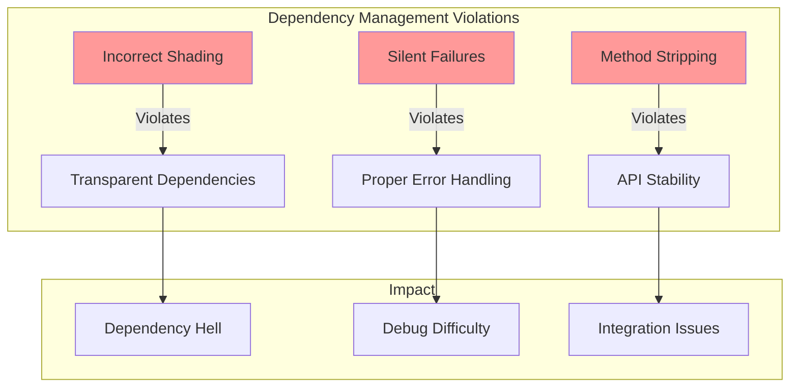

## Known Issues

### BoundedInputStream Reflection Issue

The application encounters a critical issue with the Postchain client's handling of `BoundedInputStream`. This issue manifests when attempting to read responses from the blockchain, particularly during todo list operations.


#### Technical Details

The issue stems from Postchain client's internal repackaging (shading) of Commons IO library:


#### Evidence from Logs

```
Commons IO ClassLoader: dalvik.system.PathClassLoader[...base.apk]
Implementation Version: 0.0 from Unknown
Commons IO loaded from: null
```

[Link to full logs](TODO: Add link to logs)

### Attempted Solutions

We've extensively investigated and attempted multiple solutions:

#### 1. Dependency Management
- Explicit dependency declaration
- Forcing Commons IO version
- Dependency tree conflict resolution
```gradle
implementation('commons-io:commons-io:2.7') {
    force = true
}
```

#### 2. Build Configuration
- Manifest preservation
- Custom packaging options
```gradle
android {
    packagingOptions {
        preserve 'META-INF/MANIFEST.MF'
        preserve 'META-INF/LICENSE.txt'
    }
}
```

#### 3. ProGuard Rules
- Custom rules for Commons IO
- Method preservation
```proguard
-keep class org.apache.commons.io.** { *; }
-keepclassmembers class org.apache.commons.io.** { *; }
```

#### 4. Custom Wrapper Implementation
- IOWrapper class creation
- Extension functions
```kotlin
object IOWrapper {
    fun readAllBytes(input: InputStream): ByteArray
}
```

### Why Solutions Failed


#### The Unsolvable Circle

1. **Shading Issue**
   - Postchain repackages Commons IO internally
   - Original class signatures are modified
   - Version information is stripped

2. **Access Problem**
   - Can't access shaded classes
   - Can't modify internal implementation
   - Can't intercept before shading

3. **Solution Limitations**
   - ProGuard can't protect already-shaded classes
   - Wrappers can't access internal classes
   - Dependency management can't override shaded classes

[Screenshots of dependency tree](TODO: Add screenshots)

### Library Best Practices Violations

The Postchain client library violates several critical library development best practices:



#### 1. Dependency Handling
- ❌ Improper dependency shading without relocating packages
- ❌ No documentation about shaded dependencies
- ❌ No way to exclude or replace shaded dependencies
- ✓ Should use proper dependency management with clear documentation

#### 2. API Design
- ❌ Silent failures instead of proper error propagation
- ❌ Undocumented internal dependency modifications
- ❌ Breaking changes in internal dependencies
- ✓ Should maintain backward compatibility and proper error handling

#### 3. Library Packaging
- ❌ Strips essential methods from dependencies
- ❌ No proper versioning of shaded dependencies
- ❌ Lacks proper manifest entries for repackaged libraries
- ✓ Should preserve full functionality of repackaged dependencies

#### 4. Integration Support
- ❌ No configuration options for dependency conflicts
- ❌ No documentation for troubleshooting common issues
- ❌ No way to override internal implementations
- ✓ Should provide clear integration guidelines and configuration options

### Conclusion

This issue is fundamentally unsolvable without modifications to the Kotlin Postchain client itself. The root cause lies in their dependency shading implementation, which:

1. Repackages Commons IO
2. Strips essential methods
3. Prevents external solutions

#### Recommendation

Report this issue to the Postchain client team, as it requires changes to their library's implementation.

[Link to issue tracker](TODO: Add link)
