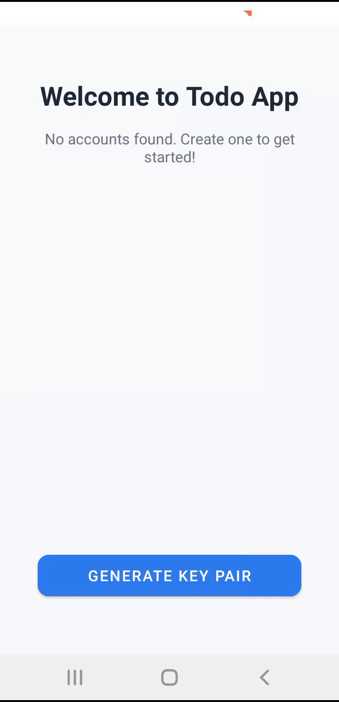
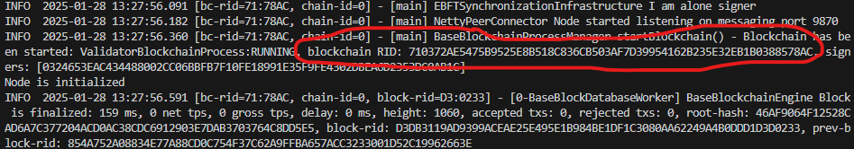
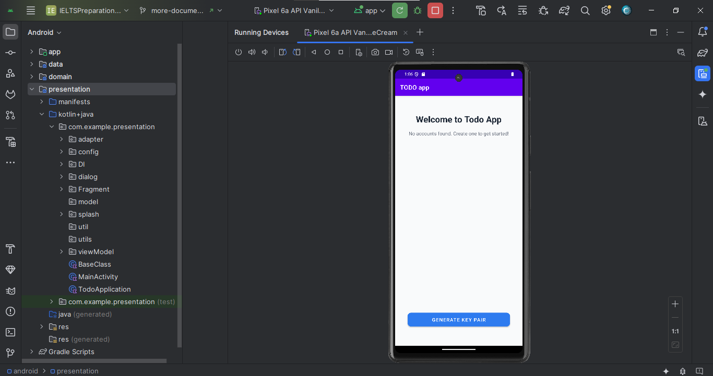

# Project Setup Guide



*Overview of the project setup process*

## 1. Chromia Node Setup

### Prerequisites
1. **Docker**
   - Install [Docker Desktop](https://www.docker.com/products/docker-desktop)
   - Ensure Docker daemon is running

2. **Node.js**
   - Install [Node.js](https://nodejs.org/) (v14 or higher)
   - Verify installation:
     ```bash
     node --version
     npm --version
     ```

### Install Chromia Development Tools
```bash
# Install Chromia CLI globally
npm install -g chr-cli

# Verify installation
chr --version
```

### Blockchain Setup

> **Important Database Setup Notes:**
> - The Chromia node requires PostgreSQL to store blockchain data
> - We use Docker to ensure a consistent PostgreSQL environment
> - Port 5432 must be available for the PostgreSQL container
> - Any local PostgreSQL service must be stopped to avoid port conflicts

1. Ensure Docker is running on your system

2. Stop your local PostgreSQL service if it's running (to avoid port conflicts):
   - Windows:
      1. Press `Windows + R`, type `services.msc` and press Enter
      2. Find "PostgreSQL Server" in the list
      3. Right-click and select "Stop" as shown below
      
   - Linux: `sudo service postgresql stop`
   - macOS: `brew services stop postgresql`

3. Start Docker Desktop

4. Start the PostgreSQL container:
```bash
docker-compose up -d
```

5. Install Chromia dependencies:
```bash
chr install
```

6. Start the local node:
```bash
   chr node start
   ```

7. Copy your BRID from the startup logs (you'll need this in the next step)
   - Look for the BRID in the node startup logs
   - Copy the BRID value
   

8. Configure the Chromia properties:
Open `android/app/src/main/assets/chromia_config.properties` and update it with your BRID:
```properties
# Local development configuration
blockchain.rid=YOUR_BRID_HERE
node.url=http://10.0.2.2:7740

```

Note: We use `10.0.2.2` instead of `localhost` because it's the special alias Android emulator uses to access the host machine's localhost.

## 2. Android Studio Setup

### 1. Install Android Studio
1. Download Android Studio from [https://developer.android.com/studio](https://developer.android.com/studio)
2. Run the installer and follow the setup wizard
3. Let Android Studio download the necessary SDK components during first launch

[image: android-studio-install.png]
*Android Studio installation wizard*

[video: sdk-download.mp4]
*SDK components downloading during first launch*

### 2. Project Setup
1. **Clone Repository**
   ```bash
   git clone <repository-url>
   cd todo_projet
   ```

2. **Open Project in Android Studio**
   - Click "File > Open"
   - Navigate to the cloned repository
   - Select the "android" folder
   - Click "OK"
   - Wait for Gradle sync to complete


3. **Configure Gradle**
   - Open `android/build.gradle`
   - Ensure all dependencies are properly synced
   - Click "Sync Now" if prompted


### 3. Run the App
1. **Create Virtual Device**
   - Go to Tools > Device Manager
   - Click "Create Device"
   - Select any Phone (e.g., Pixel 2)
   - Download and select the latest system image
   - Click "Finish"

2. **Build and Run**
   - Click the "Run" button (green play button) or press Shift + F10
   - Select your virtual device
   - Wait for the app to build and launch

   

## Development Troubleshooting

### Common Issues
1. **Build Failures**
   - Click "File > Invalidate Caches / Restart"
   - Try "Build > Clean Project" then rebuild


2. **Performance Issues**
   - Increase RAM for Android Studio in settings
   - Close unnecessary applications
   - Enable hardware acceleration in BIOS

   [image: performance-settings.png]
   *Android Studio performance settings*

### System Requirements
- Windows 10/11, macOS 10.14+, or Linux
- 8GB RAM minimum (16GB recommended)
- 10GB free storage space
- Intel Core i5/AMD Ryzen 5 or better

