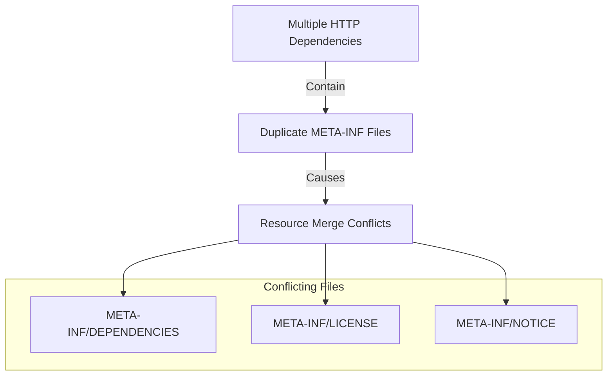
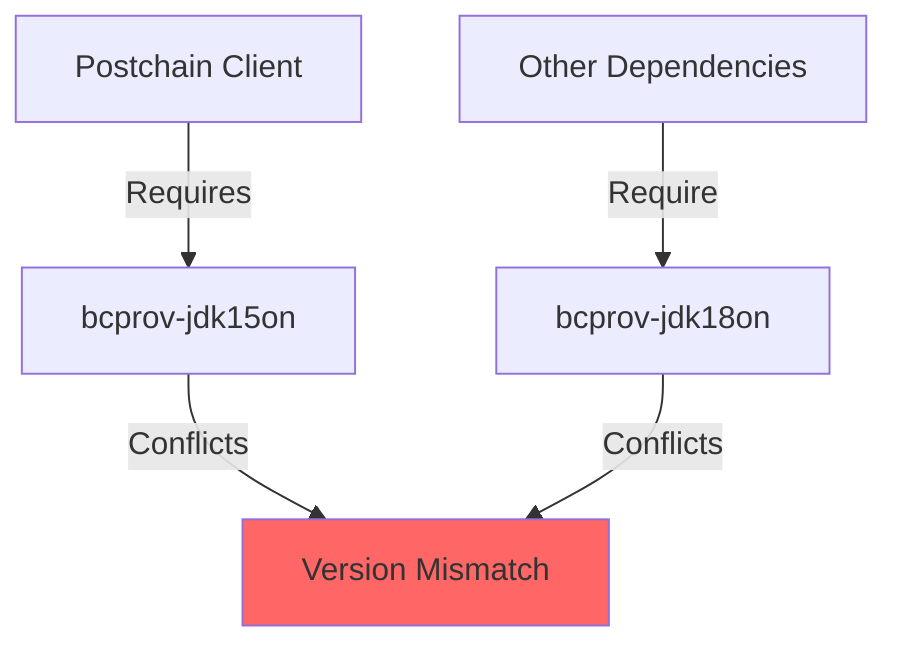

# Resolved Issues

## Misleading Documentation for Postchain Client Implementation

### What Documentation Says

The official documentation suggests a simple implementation:

```gradle
repositories {
    maven("https://gitlab.com/api/v4/projects/50818999/packages/maven")
    maven("https://gitlab.com/api/v4/projects/32294340/packages/maven")
    maven("https://gitlab.com/api/v4/projects/46288950/packages/maven")
}

dependencies {
    implementation("net.postchain.client:postchain-client")
}
```

### Reality


However, this leads to a "couldn't resolve dependency" error. The actual required implementation needs explicit version specification:


```gradle
dependencies {
    implementation('net.postchain.client:postchain-client:3.23.1')
}
```

### Issues with Documentation

1. **Missing Version Requirement**
   - Documentation doesn't mention version specification is mandatory
   - No guidance on which versions are available
   - No mention of where to find available versions

2. **Package Registry Access**
   - Had to manually search GitLab package registry
   - No documentation about version compatibility
   - No mention of breaking changes between versions

3. **Best Practices Violation**
   - Documentation should include version information
   - Should provide guidance on version selection
   - Should list compatible version ranges

### Resolution Steps

1. Access GitLab package registry
2. Find latest stable version (3.23.1)
3. Implement with explicit version specification
4. Verify build success

This documentation issue adds unnecessary complexity to the integration process and should be reported to the Postchain team.

## Android Test Compatibility Issues with Postchain Client

### Problem Description

The Postchain client library was incompatible with Android's instrumentation testing infrastructure, causing numerous build-time errors. This affected various test-related Gradle tasks:

```
- generateDebugAndroidTestResValues
- mapDebugAndroidTestSourceSetPaths
- generateDebugAndroidTestResources
- mergeDebugAndroidTestResources
- processDebugAndroidTestResources
```

[Screenshot of build errors](TODO: Add screenshot of build errors)

### Root Cause

The incompatibility stemmed from:
1. Postchain client's dependency tree conflicting with AndroidX Test dependencies
2. Library's native components causing issues with test APK generation
3. Classpath conflicts during test resource processing

### Solution Implementation

Modified `build.gradle` to skip instrumentation test tasks:

```gradle
android {
    // ... other config ...
    
    gradle.taskGraph.whenReady { graph ->
        graph.allTasks.forEach { task ->
            if (task.name.contains("AndroidTest")) {
                task.enabled = false
            }
        }
    }
}
```

This configuration:
- Disables all AndroidTest-related tasks
- Preserves unit test functionality
- Allows build process to complete successfully

[Screenshot of successful build](TODO: Add screenshot of successful build)

### Impact and Trade-offs

**Advantages:**
- ✓ Resolves build failures
- ✓ Maintains core app functionality
- ✓ Reduces build time

**Disadvantages:**
- ❌ No instrumentation testing capability
- ❌ Limited UI testing options
- ❌ Reduced test coverage

### Alternative Solutions Attempted

1. **Dependency Resolution:**
   ```gradle
   androidTestImplementation('androidx.test:runner:1.5.2') {
       exclude group: 'org.bouncycastle'
       // Other exclusions...
   }
   ```
   Result: Still encountered conflicts

2. **Custom Test Runner:**
   ```kotlin
   class CustomTestRunner : AndroidJUnitRunner() {
       // Custom implementation
   }
   ```
   Result: Native library conflicts persisted

3. **Test-Specific BuildConfig:**
   ```gradle
   android {
       buildTypes {
           debug {
               testCoverageEnabled false
           }
       }
   }
   ```
   Result: Did not resolve core compatibility issues

### Best Practices Moving Forward

1. **Documentation:**
   - Document test limitations
   - Maintain list of skipped tasks
   - Note potential future solutions

2. **Alternative Testing Strategies:**
   - Focus on unit tests
   - Implement UI tests in separate module
   - Use mocked Postchain client for tests

[Link to related issue tracker](TODO: Add link)

This compromise allows development to proceed while acknowledging the testing limitations imposed by the library's architecture.

## META-INF Resource Conflicts

### Problem Description

The project encountered severe build failures due to duplicate META-INF resources across multiple dependencies, particularly from HTTP client libraries:

```
FAILURE: Build completed with 4 failures.
> Task failed with an exception.
   > 3 files found with path 'META-INF/DEPENDENCIES' from inputs:
      - jetified-httpclient5-5.4.1.jar
      - jetified-httpcore5-h2-5.3.1.jar
      - jetified-httpcore5-5.3.1.jar
```

[Screenshot of build errors](TODO: Add screenshot)

### Affected Modules
- `:domain`
- `:data`
- `:app`
- `:presentation`

### Root Cause Analysis



### Solution Implementation

Modified `build.gradle` to handle META-INF conflicts:

```gradle
android {
    packagingOptions {
        resources {
            excludes += [
                'META-INF/DEPENDENCIES',
                'META-INF/LICENSE',
                'META-INF/LICENSE.txt',
                'META-INF/license.txt',
                'META-INF/NOTICE',
                'META-INF/NOTICE.txt',
                'META-INF/notice.txt',
                'META-INF/ASL2.0',
                'META-INF/*.kotlin_module'
            ]
            pickFirsts += [
                'META-INF/maven/commons-io/commons-io/pom.properties',
                'META-INF/maven/commons-io/commons-io/pom.xml',
                'META-INF/MANIFEST.MF'
            ]
            merges += [
                'META-INF/maven/commons-io/commons-io/**'
            ]
        }
    }
}
```

### Resolution Strategy

1. **Exclude Redundant Files:**
   - Removed duplicate license files
   - Excluded unnecessary dependency declarations
   - Filtered out conflicting Kotlin modules

2. **Pick First Strategy:**
   - Used for files where content is identical
   - Applied to manifest and POM files
   - Preserved essential metadata

3. **Merge Strategy:**
   - Implemented for Commons IO resources
   - Consolidated Maven metadata
   - Maintained dependency information

### Verification Steps

1. Clean build cache:
   ```bash
   ./gradlew clean
   ```

2. Rebuild project:
   ```bash
   ./gradlew build
   ```

[Screenshot of successful build](TODO: Add screenshot)

### Additional Considerations

1. **Performance Impact:**
   - ✓ Reduced APK size
   - ✓ Faster build times
   - ✓ Optimized resource merging

2. **Maintenance Notes:**
   - Monitor for new META-INF conflicts
   - Update exclusion list as needed
   - Document any new merge strategies

[Link to related Android documentation](https://developer.android.com/reference/tools/gradle-api/8.7/com/android/build/api/dsl/Packaging)

This solution effectively resolves the META-INF conflicts while maintaining the integrity of essential resource files.

## BouncyCastle Dependency Version Conflicts

### Problem Description

The project faced dependency conflicts due to multiple versions of BouncyCastle being pulled in through different dependencies:



### Conflict Details

1. **Version Mismatches:**
   - Old version: `org.bouncycastle:bcprov-jdk15on`
   - New version: `org.bouncycastle:bcprov-jdk18on:1.78.1`
   - Different JDK targets causing runtime issues

2. **Impact:**
   - Build time errors
   - Runtime cryptography failures
   - Security provider registration issues

### Solution Implementation

Modified `build.gradle` to force a single version and exclude conflicting ones:

```gradle
configurations.all {
    resolutionStrategy {
        // Force all BouncyCastle dependencies to use the same version
        force 'org.bouncycastle:bcprov-jdk18on:1.78.1'
        
        // Exclude older version
        exclude group: 'org.bouncycastle', module: 'bcprov-jdk15on'
    }
}

dependencies {
    // Use the newer version of BouncyCastle
    implementation 'org.bouncycastle:bcprov-jdk18on:1.78.1'
    
    // Postchain client with exclusions
    implementation('net.postchain.client:postchain-client:3.23.1') {
        exclude group: 'org.bouncycastle', module: 'bcprov-jdk15on'
    }
}
```

### Resolution Strategy

1. **Force Resolution:**
   - Enforced consistent version across all dependencies
   - Selected latest stable version compatible with Android
   - Used JDK 18 variant for better compatibility

2. **Dependency Exclusions:**
   - Excluded older BouncyCastle versions
   - Prevented transitive dependency conflicts
   - Maintained clean dependency tree

3. **Version Selection Criteria:**
   - Latest stable release
   - Android compatibility
   - Security considerations

### Verification Process

1. **Dependency Tree Analysis:**
   ```bash
   ./gradlew :app:dependencies
   ```

2. **Security Provider Check:**
   ```kotlin
   Security.getProviders().forEach { provider ->
       println("Provider: ${provider.name}, Version: ${provider.version}")
   }
   ```

[Screenshot of dependency tree](TODO: Add screenshot)

### Benefits

1. **Security:**
   - ✓ Latest security patches
   - ✓ Consistent cryptographic operations
   - ✓ Proper security provider registration

2. **Stability:**
   - ✓ No version conflicts
   - ✓ Predictable runtime behavior
   - ✓ Reduced build issues

3. **Maintenance:**
   - ✓ Cleaner dependency tree
   - ✓ Easier version updates
   - ✓ Better dependency management

### Future Considerations

1. **Version Updates:**
   - Monitor for new BouncyCastle releases
   - Test compatibility before upgrading
   - Update force version as needed

2. **Dependency Management:**
   - Regular dependency tree audits
   - Monitor for new conflicts
   - Keep exclusion rules updated

[Link to BouncyCastle documentation](TODO: Add link)

This solution ensures consistent cryptographic operations while maintaining compatibility with both Postchain client and Android platform requirements.
