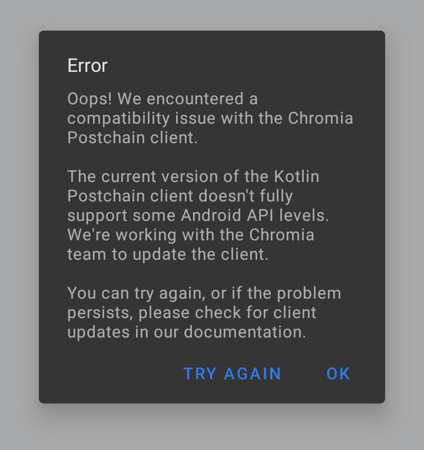

# Todo App Usage Guide

A blockchain-based todo list application that allows users to manage their tasks securely through Chromia blockchain technology.


## Features Overview


### Current Working Features
- **Account Management**: 
  - Create new accounts
  - Secure key pair generation
  - Account persistence
- **Modern UI**: 
  - Clean, intuitive Material Design interface
  - Task list with empty state handling
  - Styled action buttons and dialogs
  - Consistent color scheme and typography

### Limited Features (Due to Postchain Client Issue)
- Todo list retrieval
- Task creation
- Task updates
- Task deletion

> ⚠️ **Known Issue**: The current version of the Kotlin Postchain client has compatibility issues with some Android API levels. When performing blockchain operations, you might encounter an error like this:
> ```
> java.lang.NoSuchMethodError: No static method readAllBytes()
> ```
> This is a temporary limitation as we work with the Chromia team to update the client. When this occurs, you'll see this error dialog:



*Error dialog showing Postchain client compatibility issue*

## Using the App

### 1. First Launch
1. **Launch the App**
   - Locate "Todo App" in your device's app drawer
   - Tap to open

2. **Initial Setup**
   - The app will automatically generate a secure key pair
   - Your account will be created automatically
   - A toast notification will confirm when your account is ready
   - The "Todo List" button will appear once your account is ready

### 2. Account Management
1. **Generate Key Pair**
   - Tap the "Generate Key Pair" button
   - Wait for the key generation process
   - A success toast will appear when ready

2. **Account Information**
   - Your account ID will be displayed in the list
   - The button will update to "Generate New Key Pair"
   - The "Todo List" button appears for account access

### 3. Task Management
1. **View Tasks**
   - Clean list layout with consistent spacing
   - Each task shows title and description
   - Visual feedback for completion status

2. **Add New Task** (Limited)
   - Tap the "Add New Task" button
   - Fill in the task details:
     - Required task title
     - Optional description
   - Choose "Add Task" or "Cancel"

3. **Update Tasks** (Limited)
   - Tap a task to edit
   - Modify details in the styled form
   - Save or cancel changes

4. **Delete Tasks** (Limited)
   - Tap delete icon on task
   - Confirm in styled alert dialog

### 4. Error Handling
The app provides clear feedback for Chromia Postchain client compatibility issues:
- Friendly error dialogs explain any issues
- Clear explanation of limitations
- Option to retry operations

## UI/UX Features

### Color Scheme
- Primary blue (#2E7BEF) for main actions
- Surface colors for clean backgrounds
- Consistent text colors for hierarchy
- Ripple effects for interaction feedback

### Components
- Rounded corners on all buttons (12dp)
- Outlined text fields with rounded corners
- Consistent 56dp height for buttons
- Proper spacing and padding throughout

### Notifications
- Toast messages for non-intrusive feedback
- Dialog alerts for important information
- Clear error states in forms

## Version Information
- App Version: 1.0.0
- Minimum Android: API 30
- Target Android: API 33
- Material Design Components: 1.5.0
