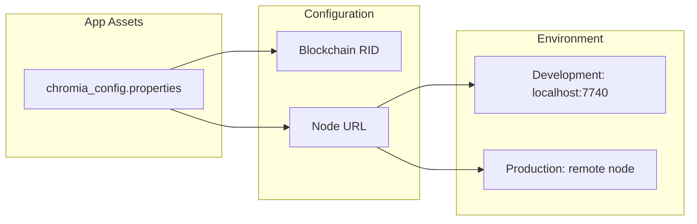
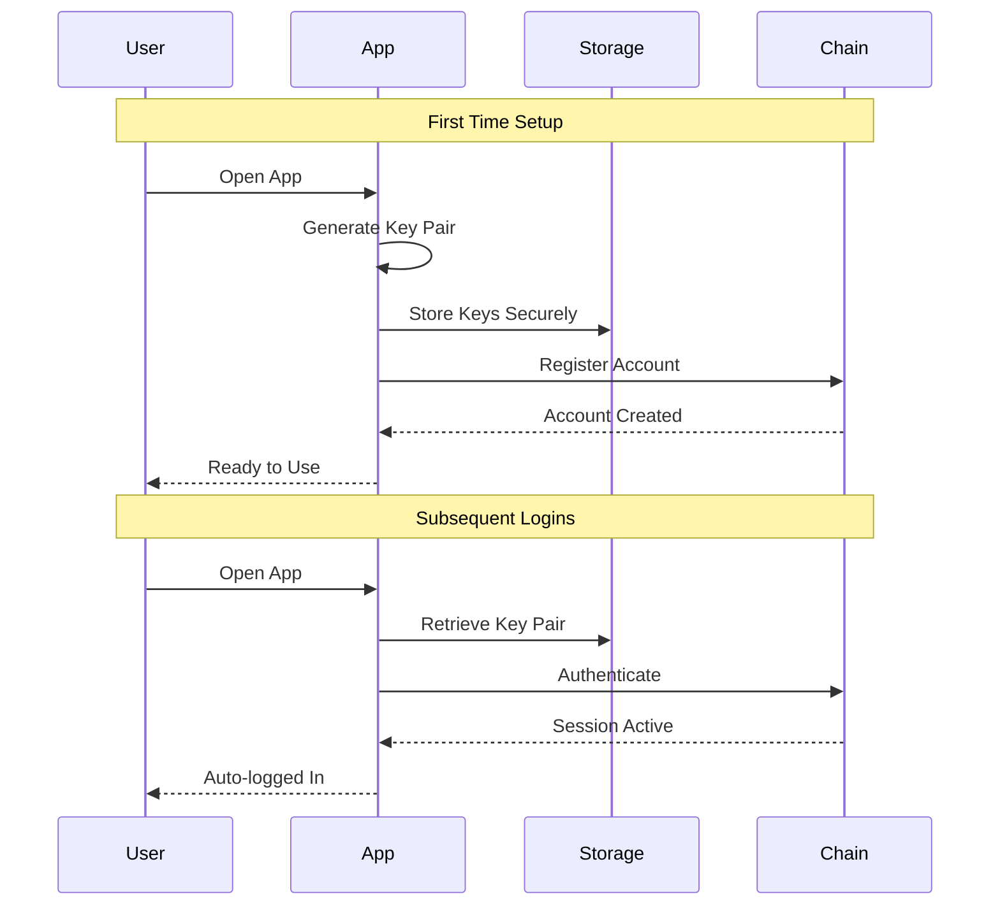
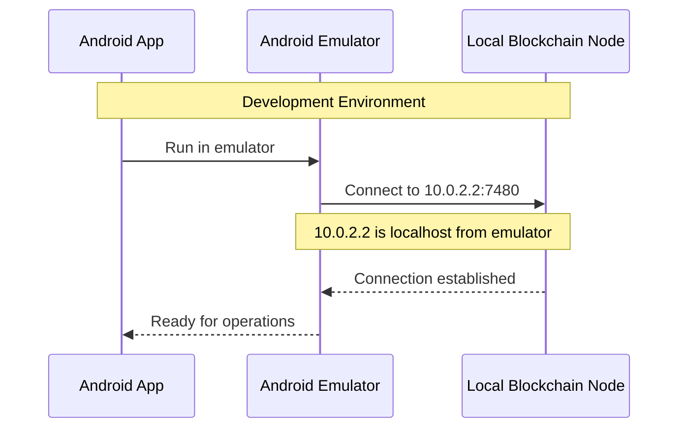
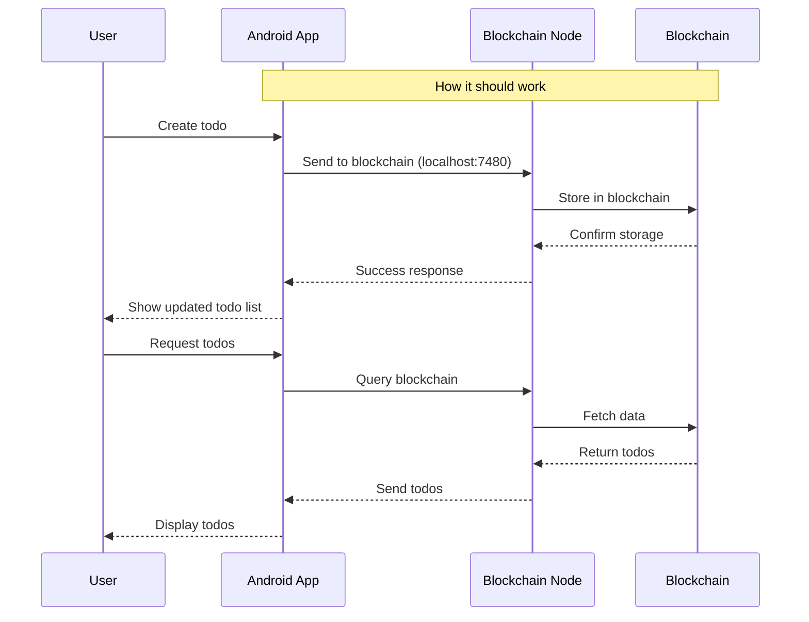

# Todo App Documentation

## Overview

This document explains how the Todo app was designed to work with the Chromia blockchain and the current limitations we're facing.

## How It Should Work

### Blockchain Configuration


The app uses a configuration file (`chromia_config.properties`) to manage blockchain connectivity:
```properties
# Development setup
blockchain.rid=F8D6FA48C1F1483726E490BCEBC62A2EBC9850CDFA15FAAC8BBA76F64B9B7B6B
node.url=http://10.0.2.2:7740

```

- BRID (Blockchain RID) uniquely identifies the blockchain
- Node URL points to blockchain node:
  - Development: `10.0.2.2:7740` (localhost from emulator)
  - Production: Would use actual Chromia node
- Configuration can be switched between development/production

### Key Pair Authentication


The app uses public-private key pairs for secure authentication:
- Key pair is generated on first launch
- Private key stays on device (never shared)
- Public key is used for blockchain account creation
- Keys are stored securely in Android Keystore
- No passwords needed - keys handle authentication
- Automatic login on subsequent launches

### Development Environment Setup


### Intended Data Flow


## Current Reality

### Current Data Flow
```