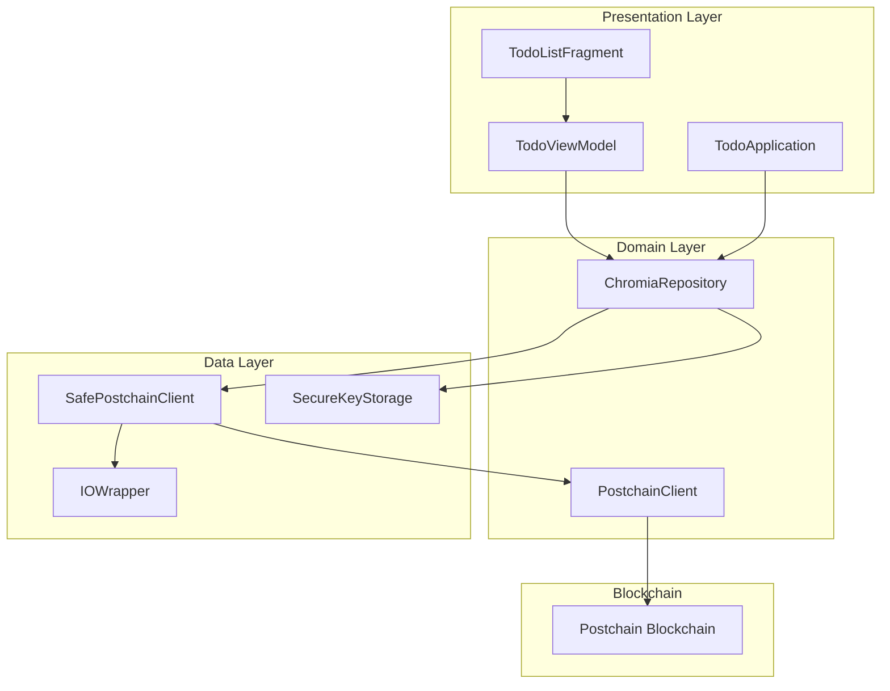
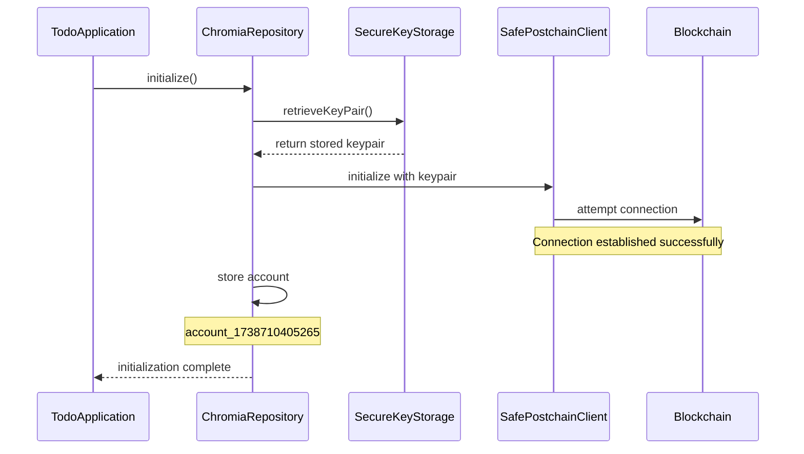
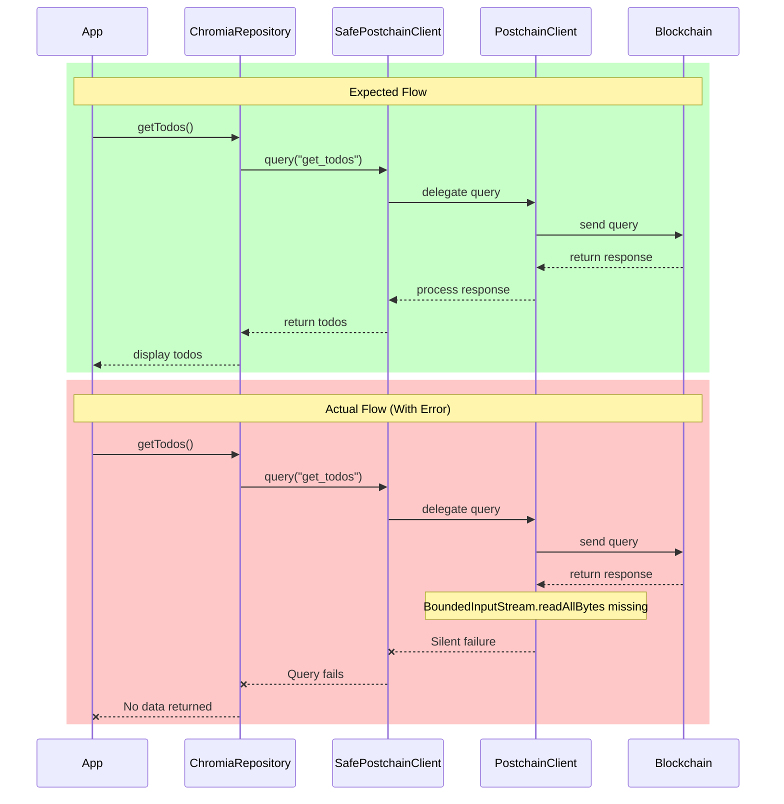
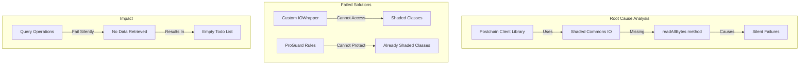

# Todo App Documentation

## Overview

This document explains how the Todo app is designed to work and its current state, particularly focusing on the Postchain client integration issues.

## System Architecture

### Components

## Current App Flow

### Initialization Process

### Data Query Process (Expected vs Actual)

## Current Issues

### 1. Postchain Client Integration Problem

### 2. Working Features

The following features are currently working as expected:

1. Key Pair Generation and Storage
2. Account Creation and Management
3. Basic UI Rendering
4. Repository Initialization

### 3. Non-Working Features

Features currently not working due to the Postchain client issue:

1. Todo List Retrieval
2. Adding New Todos
3. Updating Existing Todos
4. Deleting Todos

## Log Analysis

Based on the application logs, we can see:

1. Successful initialization:
   - Key pair retrieval works
   - Account creation successful
   - Repository initialization completes

2. Failed operations:
   - BoundedInputStream.readAllBytes method missing
   - Silent failures in SafePostchainClient
   - Query operations not completing

## Recommendations

1. Short-term workarounds:
   - Implement custom serialization/deserialization
   - Use alternative IO methods
   - Create a proxy layer for IO operations

2. Long-term solutions:
   - Work with Postchain team to fix Commons IO shading
   - Implement custom client without shaded dependencies
   - Use alternative blockchain client implementation
