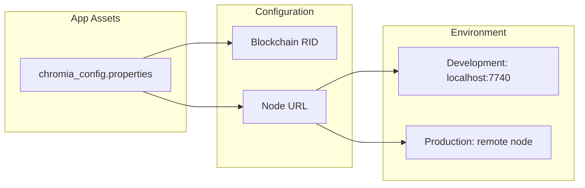
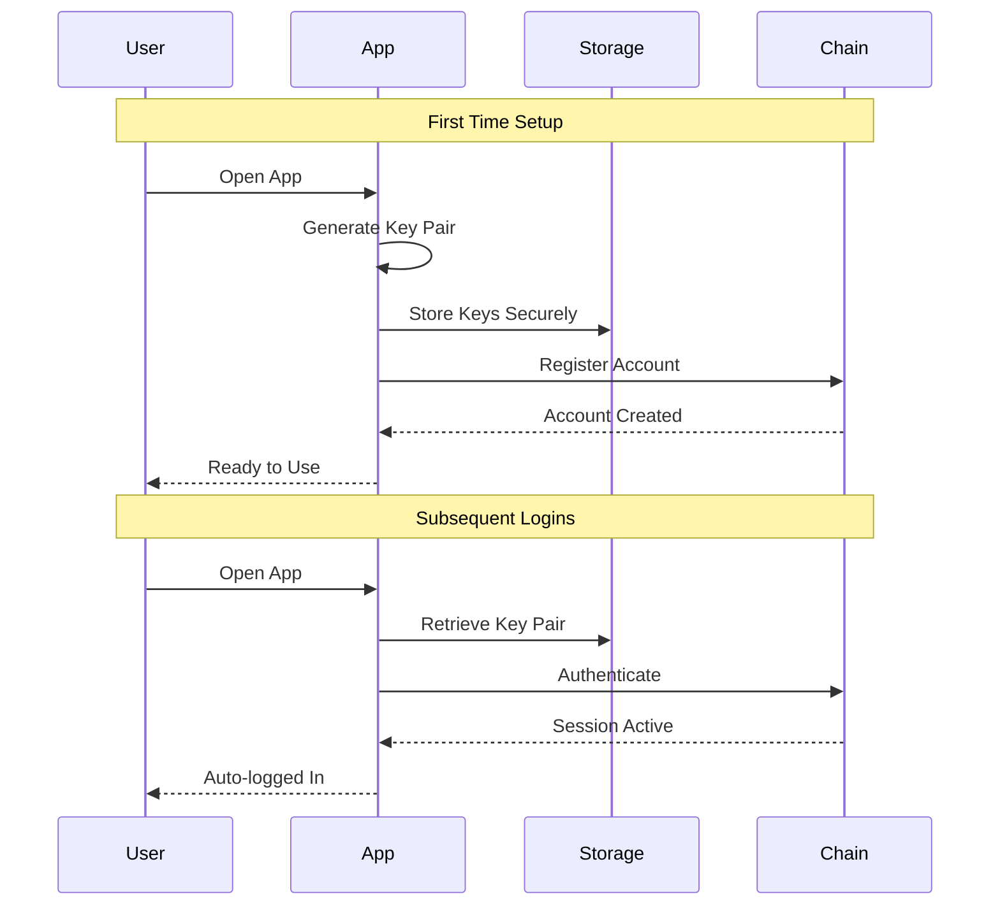
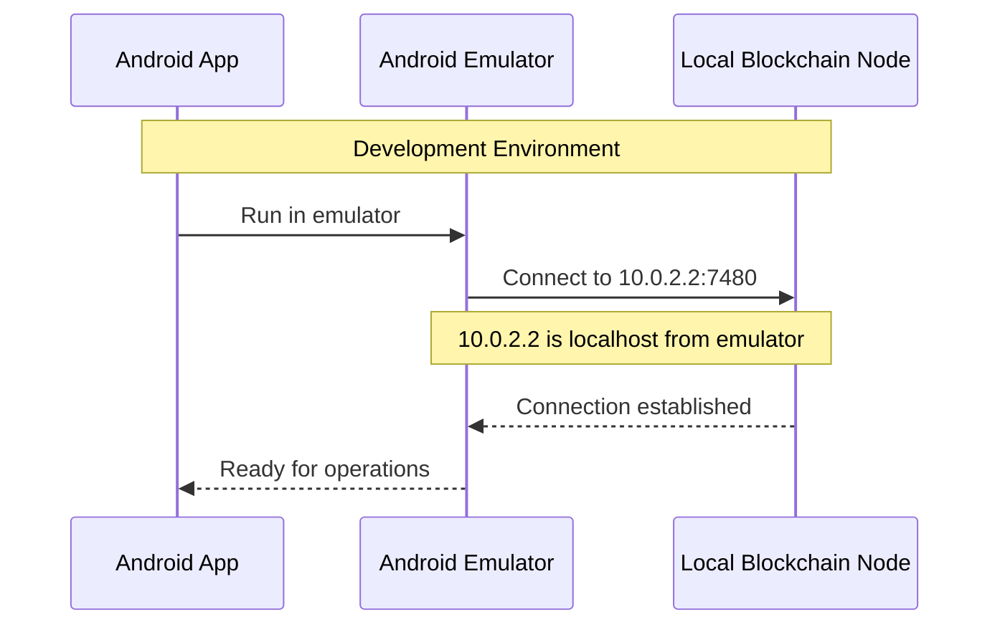
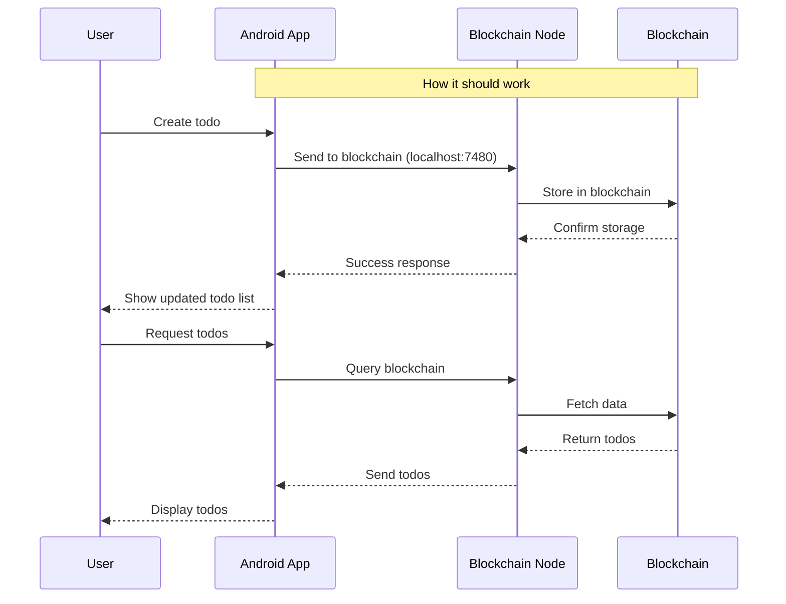
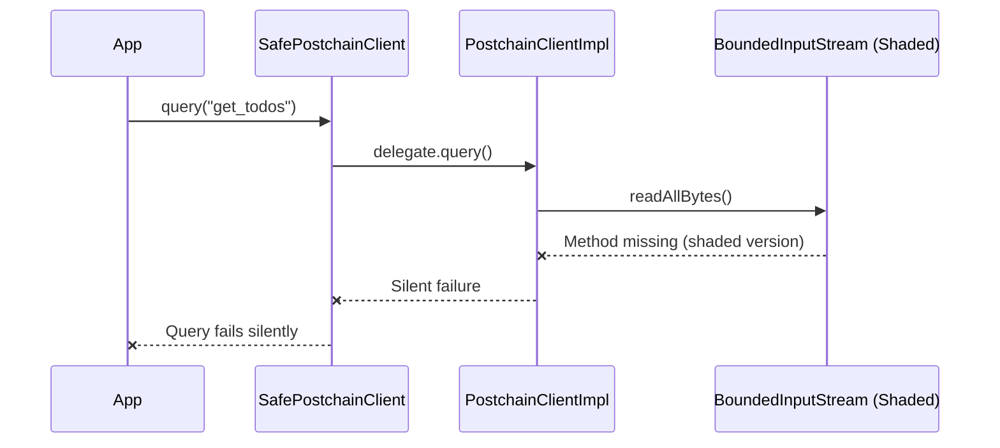
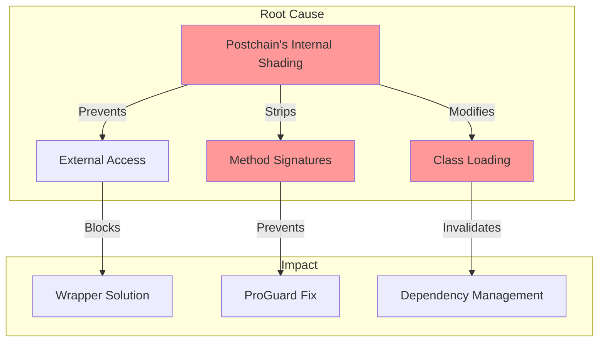
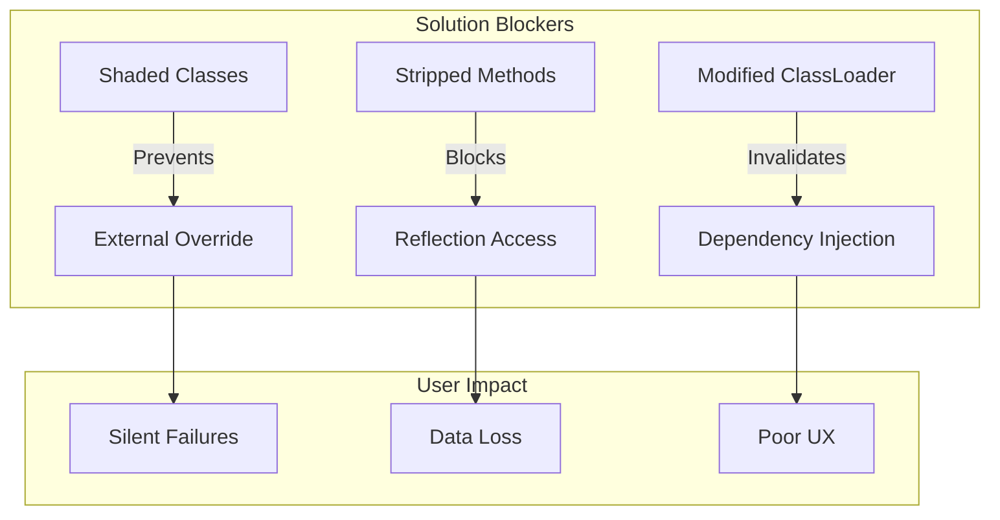

# Todo App Documentation

## Overview

This document explains how the Todo app was designed to work with the Chromia blockchain and the current limitations we're facing.

## How It Should Work

### Blockchain Configuration


The app uses a configuration file (`chromia_config.properties`) to manage blockchain connectivity:
```properties
# Development setup
blockchain.rid=F8D6FA48C1F1483726E490BCEBC62A2EBC9850CDFA15FAAC8BBA76F64B9B7B6B
node.url=http://10.0.2.2:7740

```

- BRID (Blockchain RID) uniquely identifies the blockchain
- Node URL points to blockchain node:
  - Development: `10.0.2.2:7740` (localhost from emulator)
  - Production: Would use actual Chromia node
- Configuration can be switched between development/production

### Key Pair Authentication


The app uses public-private key pairs for secure authentication:
- Key pair is generated on first launch
- Private key stays on device (never shared)
- Public key is used for blockchain account creation
- Keys are stored securely in Android Keystore
- No passwords needed - keys handle authentication
- Automatic login on subsequent launches

### Development Environment Setup


### Intended Data Flow


## Current Reality

### Current Data Flow


### Root Cause Analysis


### Technical Details

The issue stems from Postchain client's internal repackaging (shading) of Commons IO library:

1. **Library Shading Problem**
   - Postchain repackages Commons IO internally
   - Original class signatures are modified
   - Version information is stripped

2. **Method Access Issue**
   - Can't access shaded classes
   - Can't modify internal implementation
   - Can't intercept before shading

3. **Silent Failure Chain**
   - BoundedInputStream fails to find method
   - PostchainClientImpl swallows exception
   - SafePostchainClient receives no data
   - App shows error dialog to user

### Attempted Solutions

We've tried multiple approaches to resolve this:

1. **Dependency Management**
```gradle
implementation('commons-io:commons-io:2.7') {
    force = true
}
```

2. **Build Configuration**
```gradle
android {
    packagingOptions {
        preserve 'META-INF/MANIFEST.MF'
        preserve 'META-INF/LICENSE.txt'
    }
}
```

3. **ProGuard Rules**
```proguard
-keep class org.apache.commons.io.** { *; }
-keepclassmembers class org.apache.commons.io.** { *; }
```

4. **Custom Wrapper Implementation**
```kotlin
object IOWrapper {
    fun readAllBytes(input: InputStream): ByteArray
}
```

### Why Solutions Failed



### Current Workarounds

1. **Error Handling**
   - Friendly error dialogs explain the issue
   - Clear messaging about temporary limitations
   - Option to retry operations

2. **Feature Limitations**
   - Account creation still works (no blockchain reads)
   - UI remains functional and responsive
   - Clear indication of limited features

3. **User Communication**
   - Transparent about current limitations
   - Regular updates on fix progress
   - Alternative workflows where possible

### Next Steps

The issue requires changes to the Postchain client library itself:

1. **Short Term**
   - Continue showing user-friendly error messages
   - Document the issue for other developers
   - Monitor for Postchain client updates

2. **Long Term**
   - Work with Chromia team on client update
   - Consider alternative blockchain client implementation
   - Improve error handling architecture