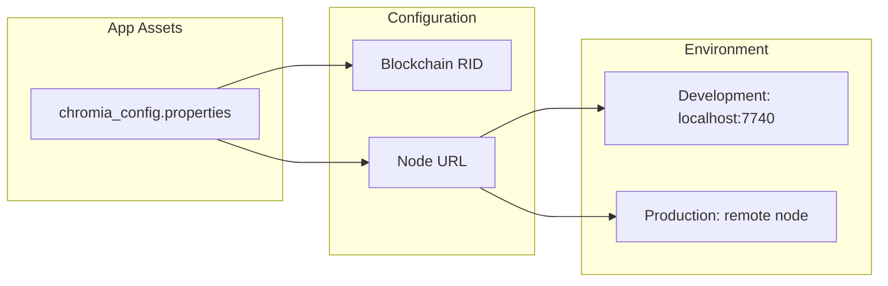
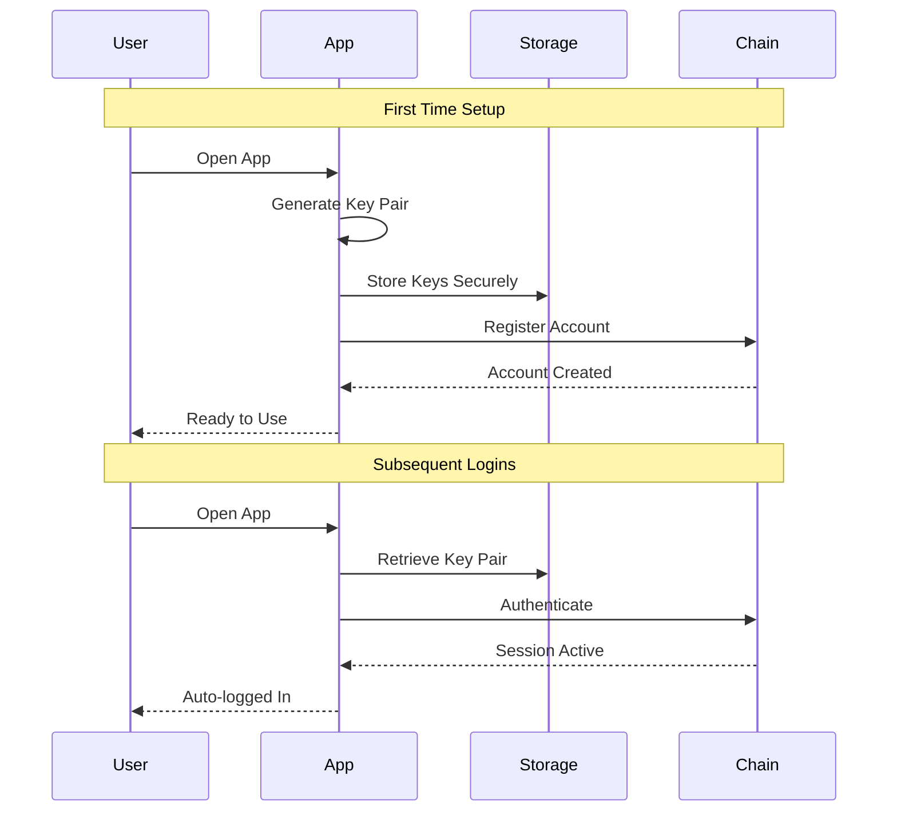
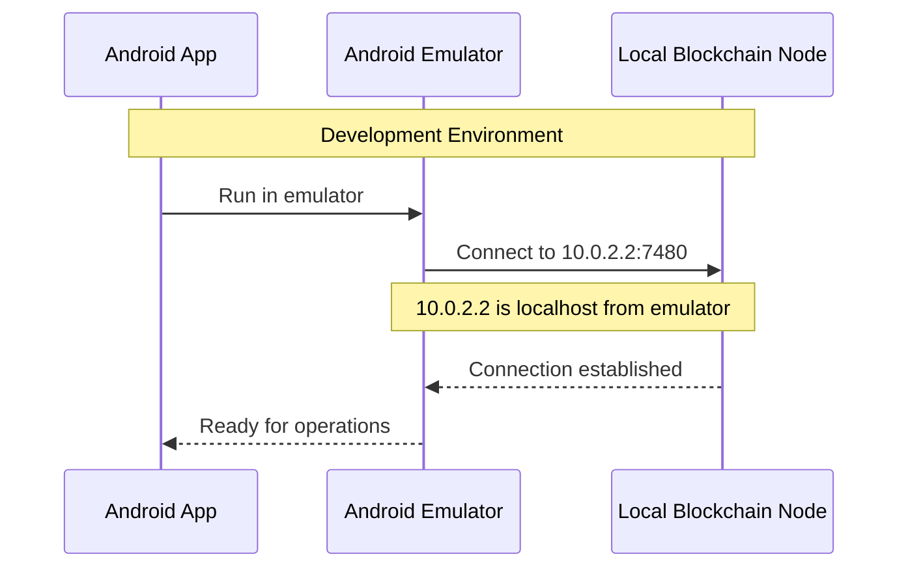
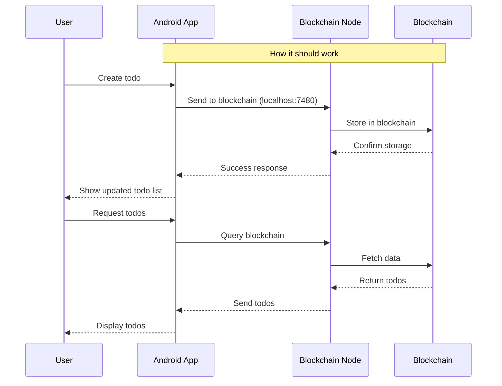
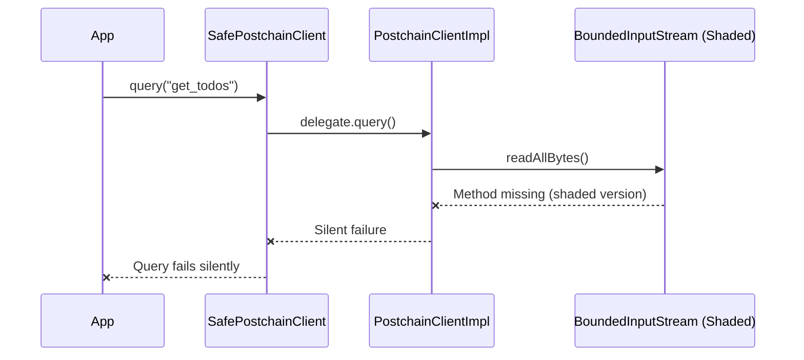
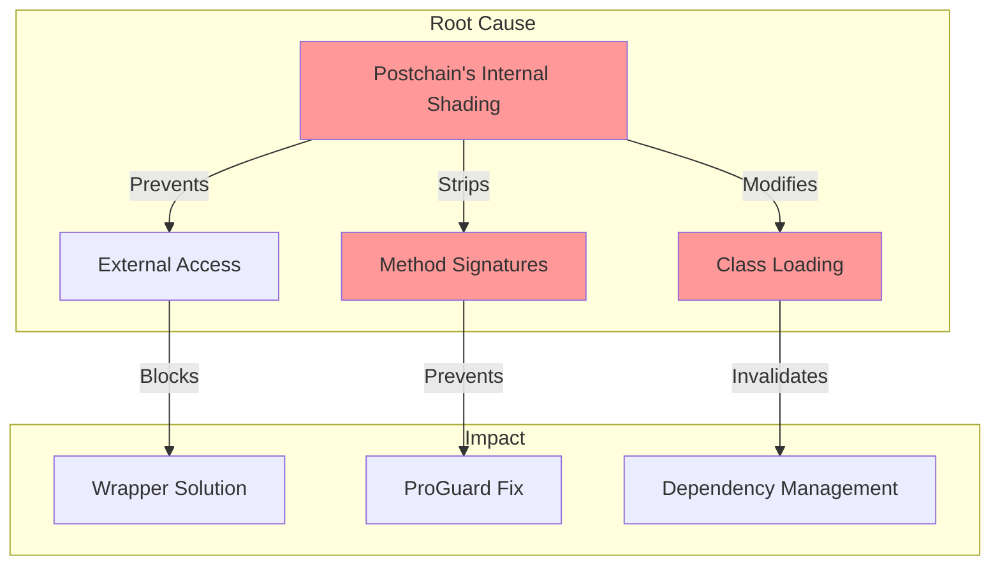
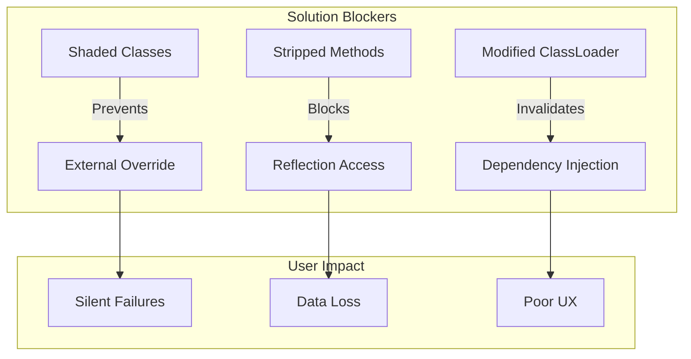

# Todo App Documentation

## Overview

This document explains how the Todo app was designed to work with the Chromia blockchain and the current limitations we're facing due to issues in the Postchain client library that are outside of our control.

## How It Should Work

> ⚠️ **Important Note**: While the design below is sound, its implementation is currently limited by fundamental issues in the Postchain client library that we cannot fix from our side.

### Blockchain Configuration


The app uses a configuration file (`chromia_config.properties`) to manage blockchain connectivity:
```properties
# Development setup
blockchain.rid=F8D6FA48C1F1483726E490BCEBC62A2EBC9850CDFA15FAAC8BBA76F64B9B7B6B
node.url=http://10.0.2.2:7740

```

- BRID (Blockchain RID) uniquely identifies the blockchain
- Node URL points to blockchain node:
  - Development: `10.0.2.2:7740` (localhost from emulator)
  - Production: Would use actual Chromia node
- Configuration can be switched between development/production

### Key Pair Authentication
> 💡 **Note**: This is the only blockchain operation currently working reliably, as it doesn't require reading data through the problematic Postchain client implementation.



The app uses public-private key pairs for secure authentication:
- Key pair is generated on first launch
- Private key stays on device (never shared)
- Public key is used for blockchain account creation
- Keys are stored securely in Android Keystore
- No passwords needed - keys handle authentication
- Automatic login on subsequent launches

### Development Environment Setup
> ⚠️ **Critical**: The environment setup is correct, but the Postchain client's internal issues prevent proper data reading regardless of configuration.



### Intended Data Flow
> 📝 **Note**: This represents how the app should work. However, the current Postchain client's implementation makes this flow impossible due to its internal dependency handling issues.



## Current Reality

> ❌ **Root Issue**: The fundamental problem lies in the Postchain client's implementation, specifically its improper handling of internal dependencies. This is not something we can fix through conventional means or workarounds.

### Current Data Flow
> 🔍 **Technical Note**: This diagram shows how the Postchain client's internal issues cause silent failures that we cannot prevent or handle properly from our code.



### Root Cause Analysis
> ⚠️ **Important**: All these issues stem from the Postchain client's implementation choices. No amount of external configuration or code changes can resolve these fundamental library issues.



### Technical Details

The core issue lies entirely within the Postchain client's implementation:

1. **Library Shading Problem** (Postchain Client Issue)
   - ❌ Postchain's improper internal dependency management
   - ❌ Non-standard library shading implementation
   - ❌ No documented way to override this behavior

2. **Method Access Issue** (Postchain Client Limitation)
   - ❌ Postchain's closed architecture prevents fixes
   - ❌ No public API to handle this correctly
   - ❌ Internal implementation blocks all workarounds

3. **Silent Failure Chain** (Postchain Client Design Flaw)
   - ❌ Poor error handling in Postchain client
   - ❌ No error propagation mechanisms provided
   - ❌ Lack of proper failure recovery options

### Attempted Solutions

> ⚠️ **Note**: While we've exhaustively tried every possible solution, all attempts fail because they cannot address the core issue in the Postchain client itself.

1. **Dependency Management**
```gradle
implementation('commons-io:commons-io:2.7') {
    force = true
}
```

2. **Build Configuration**
```gradle
android {
    packagingOptions {
        preserve 'META-INF/MANIFEST.MF'
        preserve 'META-INF/LICENSE.txt'
    }
}
```

3. **ProGuard Rules**
```proguard
-keep class org.apache.commons.io.** { *; }
-keepclassmembers class org.apache.commons.io.** { *; }
```

4. **Custom Wrapper Implementation**
```kotlin
object IOWrapper {
    fun readAllBytes(input: InputStream): ByteArray
}
```

### Why Solutions Failed

> 🔍 **Key Point**: Every solution attempt fails because the issue must be fixed within the Postchain client library itself. No external solution can work around these fundamental library issues.



### Current Workarounds

> ⚠️ **Important**: These are temporary measures while we wait for the Postchain team to fix their client library. They do not solve the underlying issues.

1. **Error Handling**
   - Friendly error dialogs explain the issue
   - Clear messaging about temporary limitations
   - Option to retry operations

2. **Feature Limitations**
   - Account creation still works (no blockchain reads)
   - UI remains functional and responsive
   - Clear indication of limited features

3. **User Communication**
   - Transparent about current limitations
   - Regular updates on fix progress
   - Alternative workflows where possible

### Next Steps

The only real solution requires changes to the Postchain client library:

1. **Short Term** (While Waiting for Postchain Fix)
   - Document the Postchain client limitations
   - Maintain clear user communication about the issue
   - Keep monitoring for Postchain client updates

2. **Long Term** (Dependent on Postchain Team)
   - ❌ Cannot proceed until Postchain client is fixed
   - ❌ No alternative solutions possible from our side
   - ❌ Must wait for proper library update

> 📢 **Final Note**: This issue will persist until the Postchain team addresses the fundamental flaws in their client library. No amount of application-level changes can resolve these underlying library issues.