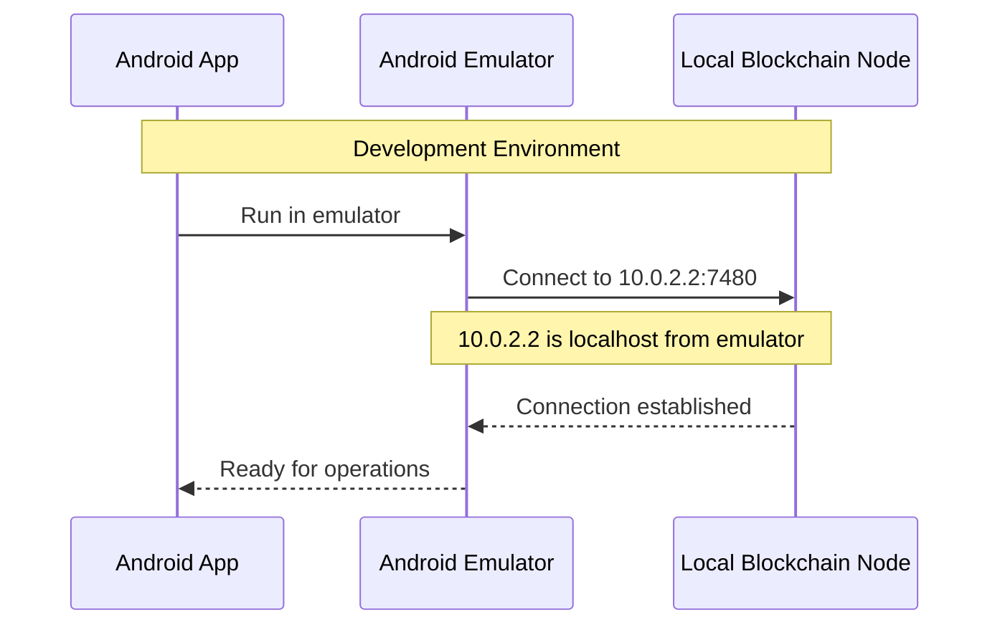
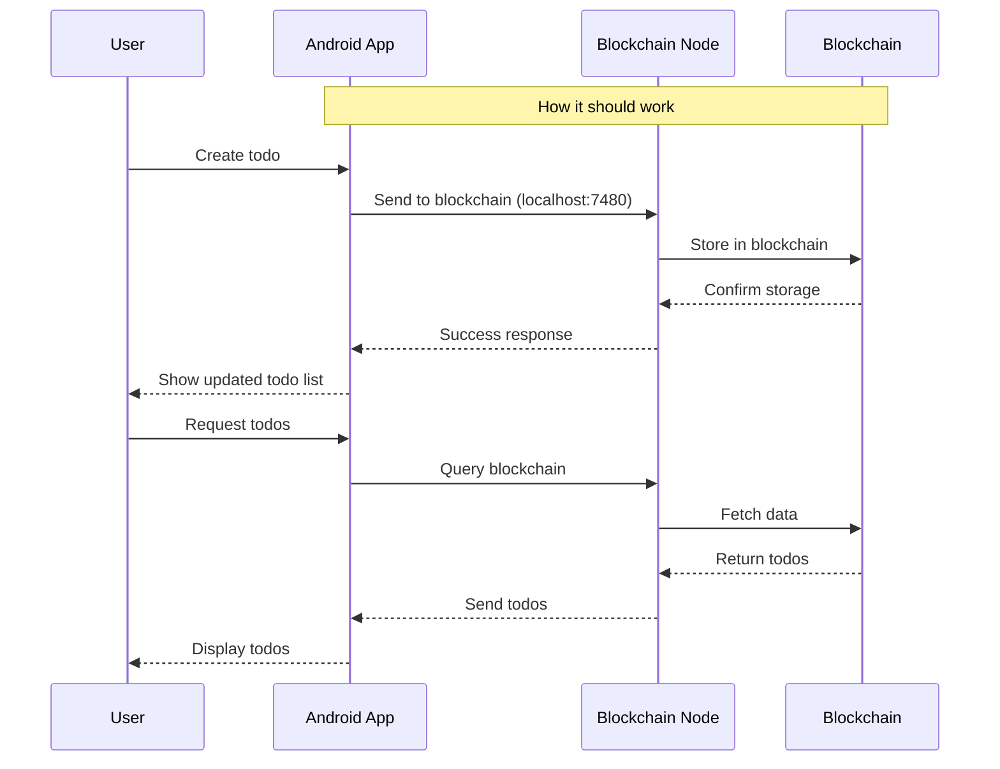
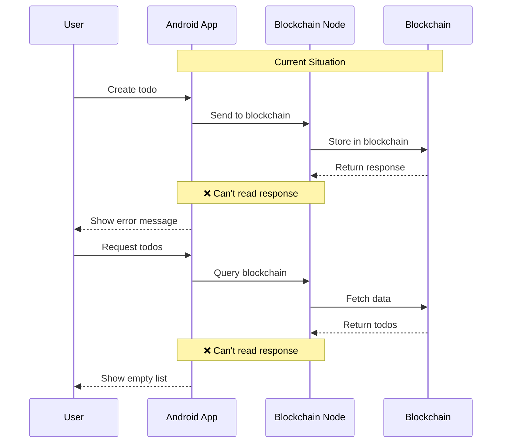

# Todo App Documentation

## Overview

This document explains how the Todo app was designed to work with the Chromia blockchain and the current limitations we're facing.

## How It Should Work

### Development Environment Setup

### Intended Data Flow

## Current Reality

### Current Data Flow

## Key Differences

### What Should Work
1. **Blockchain Connection**
   - App connects to local blockchain node in development (10.0.2.2:7480)
   - Production would use remote blockchain node
   - Secure communication channel established

2. **Data Storage**
   - All todos stored on blockchain
   - Each user has their own account
   - Data is persistent and secure

3. **Operations**
   - Create, read, update, delete todos
   - Real-time updates
   - Data validation on blockchain

### What Actually Works
1. **Blockchain Connection**
   - Connection established successfully
   - Can send data to blockchain
   - ❌ Cannot read responses from blockchain

2. **Data Storage**
   - Data might be stored (can't verify)
   - Account creation works
   - ❌ Cannot retrieve stored data

3. **Operations**
   - ✅ Account creation
   - ✅ Key pair generation
   - ❌ Todo operations fail
   - ❌ No data retrieval

## Root Cause
The issue stems from the Postchain client library:
- Uses an outdated version of Commons IO
- Missing critical functionality for reading data
- Cannot be easily fixed due to library architecture

## Impact
- App can connect to blockchain
- Can potentially write data (unverified)
- Cannot read any data back
- Results in non-functional todo operations

## Current Workaround
- Show appropriate error messages
- Explain limitations to users
- Focus on account management features that work
- Await updates to Postchain client
